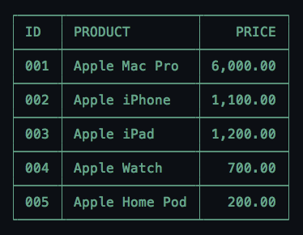

pygrid is a simple Python module for generating ASCII grids

# Usage

```python
import pygrid as g

schema = g.RowSchema(
[
  # Every column must nave a name
  {'name': 'ID'}
  ,{'name': 'PRODUCT'}

  # Specify 'left' or 'right' for cell alignment (left by default)
  ,{'name': 'PRICE', 'align': 'right'}
])

num_columns = len(schema)
rs = g.RowSet(schema)
header = g.Row(num_columns).append(*[c['name'] for c in schema.columns])
row_1 = g.Row(num_columns).append('001', 'Apple Mac Pro', '6,000.00')
row_2 = g.Row(num_columns).append('002', 'Apple iPhone', '1,100.00')
row_3 = g.Row(num_columns).append('003', 'Apple iPad', '1,200.00')
row_4 = g.Row(num_columns).append('004', 'Apple Watch', '700.00')
row_5 = g.Row(num_columns).append('005', 'Apple Home Pod', '200.00')

rs.append(header)
rs.append(row_1)
rs.append(row_2)
rs.append(row_3)
rs.append(row_4)
rs.append(row_5)

product_grid = g.Grid()
product_grid.append(rs)

print(product_grid)
```

Output:



# TODO

* Add head/foot banner support
* Add `auto`/`fixed` cell width support

